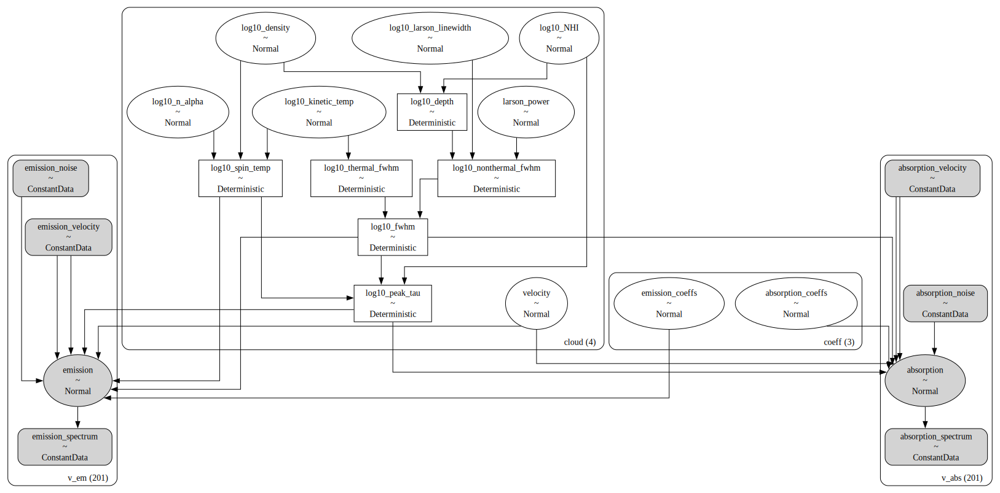
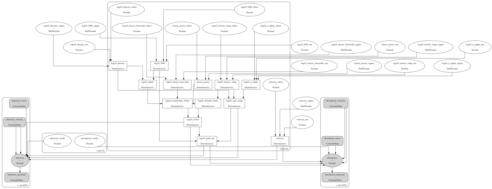
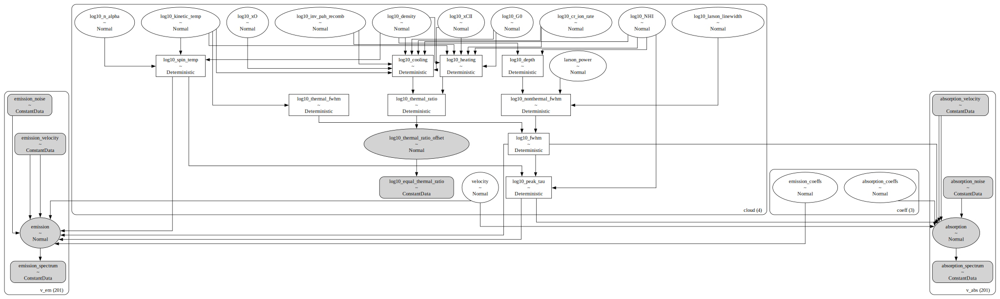
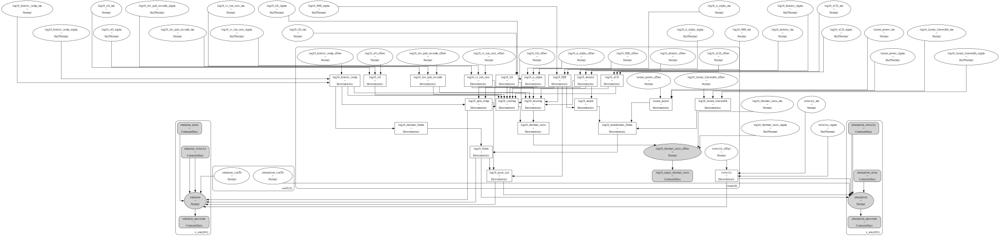

# Caribou <!-- omit in toc -->
A Bayesian Model of the Diffuse Neutral Interstellar Medium

`Caribou` fits a cloud-based model of the diffuse neutral interstellar medium to neutral hydrogen (HI) 21 cm emission and absorption spectra.

- [Installation](#installation)
- [Models](#models)
  - [`SimpleModel`](#simplemodel)
  - [`HierarchicalModel`](#hierarchicalmodel)
  - [`ThermalModel`](#thermalmodel)
  - [`HierarchicalThermalModel`](#hierarchicalthermalmodel)
- [Algorithms](#algorithms)
  - [Posterior Sampling: Variational Inference](#posterior-sampling-variational-inference)
  - [Posterior Sampling: MCMC](#posterior-sampling-mcmc)
  - [Posterior Clustering: Gaussian Mixture Models](#posterior-clustering-gaussian-mixture-models)
  - [Optimization](#optimization)
- [Syntax \& Examples](#syntax--examples)
- [Issues and Contributing](#issues-and-contributing)
- [License and Copyright](#license-and-copyright)


# Installation
Preferred: install in a `conda` virtual environment:
```
conda env create -f environment.yml
conda activate caribou
pip install .
```

Alternatively:
```
python setup.py install
```

If you wish to contribute to `Caribou`, then you may wish to install additional dependencies and install `Caribou` as an "editable" package:
```
conda env create -f environment-dev.yml
conda activate caribou-dev
pip install -e .
```

# Models

## `SimpleModel`

`Caribou` assumes that the HI emission and absorption observations can be explained by the radiative transfer of 21 cm radiation through a series of isothermal, homogenous, neutral clouds. The simplest model is implemented via the `SimpleModel` class. The following diagram demonstrates the relationship between the free parameters (empty ellipses), deterministic quantities (rectangles), model predictions (filled ellipses), and observations (filled, round rectangles). The `cloud (4)` and `coeff (3)` sub-clusters represent the parameter groups for this four-cloud (`n_cloud=4`), 2nd order polynomial baseline (`baseline_degree=2`) model. The `v_em (201)` and `v_abs (201)` sub-clusters represent the emission and absorption data, respectively. The subsequent tables describe the model parameters in more detail.



| Observations          | Data                                        | Units    | Dimension | Comment                                       |
| :-------------------- | :------------------------------------------ | :------- | :-------- | :-------------------------------------------- |
| `emission_velocity`   | Velocity axis of emission spectrum          | `km s-1` | `v_em`    | Same reference frame as `absorption_velocity` |
| `emission_noise`      | Channel-dependent emission spectrum noise   | `K`      | `v_em`    | Brightness temperature                        |
| `emission_spectrum`   | HI emission spectrum                        | `K`      | `v_em`    | Brightness temperature<br>                    |
| `absorption_velocity` | Velocity axis of absorption spectrum        | `km s-1` | `v_abs`   | Same reference frame as `emission_velocity`   |
| `absorption_noise`    | Channel-dependent absorption spectrum noise | unitless | `v_abs`   | Optical depth ($\tau$)                        |
| `absorption_spectrum` | HI absorption spectrum                      | unitless | `v_abs`   | Optical depth ($\tau$)                        |

| Free Parameter<br>`variable` (dimension `cloud`) | Parameter                               | Units    | Prior, where<br>($p_0, p_1, \dots$) = `prior_{variable}`              | Default<br>`prior_{variable}` |
| :----------------------------------------------- | :-------------------------------------- | :------- | :-------------------------------------------------------------------- | :---------------------------- |
| `log10_NHI`                                      | HI column density                       | `cm-2`   | $\log_{10}N_{\rm HI} \sim {\rm Normal}(\mu=p_0, \sigma=p_1)$          | `[20.0, 1.0]`                 |
| `log10_kinetic_temp`                             | Kinetic temperature                     | `K`      | $\log_{10}T_K \sim {\rm Normal}(\mu=p_0, \sigma=p_1)$                 | `[3.0, 1.0]`                  |
| `log10_density`                                  | HI density                              | `cm-3`   | $\log_{10}n \sim {\rm Normal}(\mu=p_0, \sigma=p_1)$                   | `[0.0, 1.0]`                  |
| `log10_n_alpha`                                  | Ly&alpha; photon density                | `cm-3`   | $\log_{10}n_\alpha \sim {\rm Normal}(\mu=p_0, \sigma=p_1)$            | `[-6.0, 1.0]`                 |
| `log10_larson_linewidth`                         | Turbulent broadening FWHM at 1 pc       | `km s-1` | $\log_{10}\Delta V_{\rm 1 pc} \sim {\rm Normal}(\mu=p_0, \sigma=p_1)$ | `[0.2, 0.1]`                  |
| `larson_power`                                   | Turbulent size-linewidth power law      | unitless | $\alpha \sim {\rm Normal}(\mu=p_0, \sigma=p_1)$                       | `[0.4, 0.1]`                  |
| `velocity`                                       | Velocity (same reference frame as data) | `km s-1` | $V \sim {\rm Normal}(\mu=p_0, \sigma=p_1)$                            | `[0.0, 10.0]`                 |

| Deterministic Quantity<br>(dimension `cloud`) | Quantity                 | Units    | Relationship                                                        | Comment                                                                                               |
| :-------------------------------------------- | :----------------------- | :------- | :------------------------------------------------------------------ | :---------------------------------------------------------------------------------------------------- |
| `log10_spin_temp`                             | Spin temperature         | `K`      | $T_S = f(T_K, n, n_\alpha)$                                         | [Kim et al. (2014)](https://ui.adsabs.harvard.edu/abs/2014ApJ...786...64K/abstract) equation 4        |
| `log10_thermal_fwhm`                          | Thermal FWHM linewidth   | `km s-1` | $\Delta V_{\rm th} = \sqrt{8\ln2\frac{k_B T_K}{m_p}}$               |
| `log10_depth`                                 | Line-of-sight depth      | `pc`     | $d = \frac{N_{\rm HI}}{n}$                                          |
| `log10_nonthermal_fwhm`                       | Turbulent FWHM linewidth | `km s-1` | $\Delta V_{\rm nth} = \Delta V_{\rm 1 pc}(\frac{d}{\rm pc})^\alpha$ |
| `log10_fwhm`                                  | Total FWHM linewidth     | `km s-1` | $\Delta V = \sqrt{\Delta V_{\rm th}^2 + \Delta V_{\rm nth}^2}$      |
| `log10_peak_tau`                              | Peak optical depth       | `km s-1` | $\tau_0 = f(n, T_S, \Delta V)$                                      | [Marchal et al. (2019)](https://ui.adsabs.harvard.edu/abs/2019A%26A...626A.101M/abstract) equation 15 |

| Model Prediction | Quantity                  | Units    | Dimension | Likelihood                                                                                       | Comment                                                                                               |
| :--------------- | :------------------------ | :------- | :-------- | :----------------------------------------------------------------------------------------------- | :---------------------------------------------------------------------------------------------------- |
| `emission`       | HI emission spectrum      | `K`      | `v_em`    | ${\rm Normal}(\mu = f(T_s, \tau) -$  `emission_spectrum` $, \sigma=$ `emission_noise` $)$           | [Marchal et al. (2019)](https://ui.adsabs.harvard.edu/abs/2019A%26A...626A.101M/abstract) equation 14 |
| `absorption`     | HI optical depth spectrum | unitless | `v_abs`   | ${\rm Normal}(\mu = f(n, T_S, \Delta V) -$ `absorption_spectrum` $, \sigma=$ `absorption_noise` $)$ | [Marchal et al. (2019)](https://ui.adsabs.harvard.edu/abs/2019A%26A...626A.101M/abstract) equation 15 |

## `HierarchicalModel`

An extension of `SimpleModel`, where the prior distribution shapes are themselves free parameters. The cloud parameters are then determined from these hyper-prior distributions using a non-centered hierarchical model. The hyperparameters are described below.



| Free Parameter<br>`variable` (dimension `cloud`) | Hyper-distribution                 | Units    | Hyper-prior, where<br>($p_0, p_1, \dots$) = `prior_{variable}`                                                                                                                                                                                                                  | Default `prior_{variable}` |
| :----------------------------------------------- | :--------------------------------- | :------- | :------------------------------------------------------------------------------------------------------------------------------------------------------------------------------------------------------------------------------------------------------------------------------ | :------------------------- |
| `log10_NHI`                                      | HI column density                  | `cm-2`   | `log10_NHI_mu` $\sim {\rm Normal}(\mu = p_0, \sigma = p_1)$<br> `log10_NHI_sigma` $\sim {\rm HalfNormal}(\sigma = p_2)$<br>$\log_{10}N_{\rm HI} \sim {\rm Normal}(\mu=$ `log10_NHI_mu` $, \sigma=$ `log10_NHI_sigma` $)$                                                             | `[20.0, 0.5, 0.5]`         |
| `log10_kinetic_temp`                             | Kinetic temperature                | `K`      | `log10_kinetic_temp_mu` $\sim {\rm Normal}(\mu = p_0, \sigma = p_1)$<br> `log10_kinetic_temp_sigma` $\sim {\rm HalfNormal}(\sigma = p_2)$<br>$\log_{10}T_K \sim {\rm Normal}(\mu=$ `log10_kinetic_temp_mu` $, \sigma=$ `log10_kinetic_temp_sigma` $)$                                | `[3.0, 0.5, 0.5]`          |
| `log10_density`                                  | HI density                         | `cm-3`   | `log10_density_mu` $\sim {\rm Normal}(\mu = p_0, \sigma = p_1)$<br> `log10_density_sigma` $\sim {\rm HalfNormal}(\sigma = p_2)$<br>$\log_{10}n \sim {\rm Normal}(\mu=$ `log10_density_mu` $, \sigma=$ `log10_density_sigma` $)$                                                      | `[0.0, 0.5, 0.5]`          |
| `log10_n_alpha`                                  | Ly&alpha; photon density           | `cm-3`   | `log10_n_alpha_mu` $\sim {\rm Normal}(\mu = p_0, \sigma = p_1)$<br>`log10_n_alpha_sigma` $\sim {\rm HalfNormal}(\sigma = p_2)$ <br> $\log_{10}n_\alpha \sim {\rm Normal}(\mu=$ `log10_n_alpha_mu` $, \sigma=$ `log10_n_alpha_sigma` $)$                                               | `[-6.0, 0.5, 0.5]`         |
| `log10_larson_linewidth`                         | Turbulent broadening FWHM at 1 pc  | `km s-1` | `log10_larson_linewidth_mu` $\sim {\rm Normal}(\mu = p_0, \sigma = p_1)$ <br> `log10_larson_linewidth_sigma` $\sim {\rm HalfNormal}(\sigma = p_2)$ <br> $\log_{10}\Delta V_{\rm 1 pc} \sim {\rm Normal}(\mu=$ `log10_larson_linewidth_mu` $, \sigma=$ `log10larson_linewidth_sigma` $)$ | `[0.2, 0.05, 0.05]`        |
| `larson_power`                                   | Turbulent size-linewidth power law | unitless | `larson_power_mu` $\sim {\rm Normal}(\mu = p_0, \sigma = p_1)$ <br> `larson_power_sigma` $\sim {\rm HalfNormal}(\sigma = p_2)$ <br> $\alpha \sim {\rm Normal}(\mu=$ `larson_power_mu` $, \sigma=$ `larson_power_sigma` $)$                                                              | `[0.4, 0.05, 0.05]`        |
| `velocity`                                       | Velocity                           | `km s-1` | `velocity_mu` $\sim {\rm Normal}(\mu = p_0, \sigma = p_1)$ <br> `velocity_sigma` $\sim {\rm HalfNormal}(\sigma = p_2)$ <br> $V \sim {\rm Normal}(\mu=$ `velocity_mu` $, \sigma=$ `velocity_sigma` $)$                                                                                   | `[0.0, 5.0, 5.0]`          |

## `ThermalModel`

`ThermalModel` extends `SimpleModel` to additionally constrain the thermal balance of each cloud. This model is demonstrated and described below.



| Observation                | Data  | Units    | Dimension | Comment                                                         |
| :------------------------- | :---- | :------- | :-------- | :-------------------------------------------------------------- |
| `log10_zero_thermal_ratio` | Zeros | Unitless | `cloud`   | Forces `log10_thermal_ratio_offset` to match prior distribution |

| Free Parameter<br>`variable` (dimension `cloud`) | Parameter                                    | Units                                  | Prior, where<br>($p_0, p_1, \dots$) = `prior_{variable}`                     | Default<br>`prior_{variable}` |
| :----------------------------------------------- | :------------------------------------------- | :------------------------------------- | :--------------------------------------------------------------------------- | :---------------------------- |
| `log10_cr_ion_rate`                              | Soft X-ray and cosmic ray ionization rate    | `s-1`                                  | $\log_{10}\zeta_{\rm CR} \sim {\rm Normal}(\mu=p_0, \sigma=p_1)$             | `[-16.0, 1.0]`                |
| `log10_G0`                                       | FUV radiation field normalization            | Habing<br>(1 = local,<br>1.6 = Draine) | $\log_{10}G_0 \sim {\rm Normal}(\mu=p_0, \sigma=p_1)$                        | `[0.0, 1.0]`                  |
| `log10_xCII`                                     | ${\rm C}^+$ abundance                        | unitless                               | $\log_{10}x_{{\rm C}^+} \sim {\rm Normal}(\mu=p_0, \sigma=p_1)$              | `[-4.0, 1.0]`                 |
| `log10_xO`                                       | O abundance                                  | unitless                               | $\log_{10}x_{\rm O} \sim {\rm Normal}(\mu=p_0, \sigma=p_1)$                  | `[-4.0, 1.0]`                 |
| `log10_inv_pah_recomb`                           | Recombination parameter of electrons on PAHs | unitless                               | $\log_{10}\phi^{-1}_{\rm PAH} \sim {\rm Normal}$<br> $(\mu=p_0, \sigma=p_1)$ | `[0.2, 0.1]`                  |

| Deterministic Quantity<br>(dimension `cloud`) | Quantity                   | Units          | Relationship                                                                    | Comment                                                                                              |
| :-------------------------------------------- | :------------------------- | :------------- | :------------------------------------------------------------------------------ | :--------------------------------------------------------------------------------------------------- |
| `log10_elec_density`                          | Electron density           | `cm-3`         | $n_e = f(n, \zeta_{\rm CR}, T_K, G_0, x_{{\rm C}^+}, \phi_{\rm PAH})$           | [Bellomi et al. (2020)](https://ui.adsabs.harvard.edu/abs/2020A%26A...643A..36B/abstract) Appendix B |
| `log10_cooling`                               | Cooling rate               | `erg s-1 cm-3` | $\mathcal{L} = f(n, n_e, T_K, G_0, x_{{\rm C}^+}, x_{{\rm O}}, \phi_{\rm PAH})$ | [Bellomi et al. (2020)](https://ui.adsabs.harvard.edu/abs/2020A%26A...643A..36B/abstract) Appendix B |
| `log10_heating`                               | Heating rate               | `erg s-1 cm-3` | $\mathcal{G} = f(n, n_e, T_K, G_0, x_{{\rm C}^+}, x_{{\rm O}}, \phi_{\rm PAH})$ | [Bellomi et al. (2020)](https://ui.adsabs.harvard.edu/abs/2020A%26A...643A..36B/abstract) Appendix B |
| `log10_thermal_ratio`                         | Cooling divided by heating | unitless       | $\log_{10}(\mathcal{L}/\mathcal{G})$                                            |                                                                                                      |


| Model Prediction             | Quantity                             | Units    | Dimension | Likelihood                                                                                                                              | Comment                                                                            |
| :--------------------------- | :----------------------------------- | :------- | :-------- | :-------------------------------------------------------------------------------------------------------------------------------------- | :--------------------------------------------------------------------------------- |
| `log10_thermal_ratio_offset` | Thermal ratio offset from prior mean | unitless | `cloud`   | ${\rm Normal}(\mu = \log_{10}(\mathcal{L}/\mathcal{G}) -$ `prior_log10_thermal_ratio[0]` $, \sigma=$ `prior_log10_thermal_ratio[1]` $)$ | Technically we "observe" `log10_zero_thermal_ratio`<br>Default prior: `[0.0, 1.0]` |

## `HierarchicalThermalModel`

An extension of `ThermalModel`, where the prior distribution shapes are themselves free parameters. The cloud parameters are then determined from these hyperprior distributions using a non-centered hierarchical model. The hyperparameters are described below.



| Free Parameter<br>`variable` (dimension `cloud`) | Hyper-distribution                           | Units    | Hyper-prior, where<br>($p_0, p_1, \dots$) = `prior_{variable}`                                                                                                                                                                                                            | Default `prior_{variable}` |
| :----------------------------------------------- | :------------------------------------------- | :------- | :------------------------------------------------------------------------------------------------------------------------------------------------------------------------------------------------------------------------------------------------------------------------ | :------------------------- |
| `log10_cr_ion_rate`                              | Soft X-ray and cosmic ray ionization rate    | `s-1`    | `log10_cr_ion_mu` $\sim {\rm Normal}(\mu = p_0, \sigma = p_1)$ <br> `log10_cr_ion_sigma` $\sim {\rm HalfNormal}(\sigma = p_2)$ <br> $\log_{10}\zeta_{\rm CR} \sim {\rm Normal}(\mu=$ `log10_cr_ion_mu` $, \sigma=$ `log10_cr_ion_sigma` $)$                                       | `[-16.0, 0.5, 0.5]`        |
| `log10_G0`                                       | FUV radiation field normalization            | Habing   | `log10_G0_mu` $\sim {\rm Normal}(\mu = p_0, \sigma = p_1)$ <br> `log10_G0_sigma` $\sim {\rm HalfNormal}(\sigma = p_2)$ <br> $\log_{10}G_0 \sim {\rm Normal}(\mu=$ `log10_G0_mu` $, \sigma=$ `log10_G0_sigma` $)$                                                                  | `[0.0, 0.5, 0.5]`          |
| `log10_xCII`                                     | ${\rm C}^+$ abundance                        | unitless | `log10_xCII_mu` $\sim {\rm Normal}(\mu = p_0, \sigma = p_1)$ <br> `log10_xCII_sigma` $\sim {\rm HalfNormal}(\sigma = p_2)$ <br> $\log_{10}x_{{\rm C}^+} \sim {\rm Normal}(\mu=$ `log10_xCII_mu` $, \sigma=$ `log10_xCII_sigma` $)$                                                | `[-4.0, 0.5, 0.5]`         |
| `log10_xO`                                       | O abundance                                  | unitless | `log10_xO_mu` $\sim {\rm Normal}(\mu = p_0, \sigma = p_1)$ <br> `log10_xO_sigma` $\sim {\rm HalfNormal}(\sigma = p_2)$ <br> $\log_{10}x_{{\rm O}} \sim {\rm Normal}(\mu=$ `log10_xO_mu` $, \sigma=$ `log10_xO_sigma` $)$                                                          | `[-4.0, 0.5, 0.5]`         |
| `log10_inv_pah_recomb`                           | Recombination parameter of electrons on PAHs | unitless | `log10_inv_pah_recomb_mu` $\sim {\rm Normal}(\mu = p_0, \sigma = p_1)$ <br> `log10_inv_pah_recomb_sigma` $\sim {\rm HalfNormal}(\sigma = p_2)$ <br> $\log_{10} \phi^{-1}_{\rm PAH} \sim {\rm Normal}(\mu=$ `log10_inv_pah_recomb_mu` $, \sigma=$ `log10_inv_pah_recomb_sigma` $)$ | `[0.2, 0.05, 0.05]`        |
|                                                  |

| Model Prediction             | Quantity                             | Units    | Dimension | Likelihood                                                                                                                                                                                                                                                                            | Comment                                                                                 |
| :--------------------------- | :----------------------------------- | :------- | :-------- | :------------------------------------------------------------------------------------------------------------------------------------------------------------------------------------------------------------------------------------------------------------------------------------ | :-------------------------------------------------------------------------------------- |
| `log10_thermal_ratio_offset` | Thermal ratio offset from prior mean | unitless | `cloud`   | ${\rm Normal}(\mu = \log_{10}(\mathcal{L}/\mathcal{G}) -$ `log10_thermal_ratio_mu` $, \sigma=$ `log10_thermal_ratio_sigma` $)$<br>where<br>`log10_thermal_ratio_mu` $\sim {\rm Normal}(\mu = p_0, \sigma = p_1)$<br>`log10_thermal_ratio_sigma` $\sim {\rm HalfNormal}(\sigma = p_2)$ | Technically we "observe" `log10_zero_thermal_ratio`<br>Default prior: `[0.0, 0.5, 0.5]` |


# Algorithms

## Posterior Sampling: Variational Inference

`Caribou` can sample from an approximation of model posterior distribution using [variational inference (VI)](https://www.pymc.io/projects/examples/en/latest/variational_inference/variational_api_quickstart.html). The benefit of VI is that it is fast, but the downside is that it often fails to capture complex posterior topologies. We recommend only using VI for quick model tests or MCMC initialization. Draw posterior samples using VI via `model.fit()`.

## Posterior Sampling: MCMC

`Caribou` can also use MCMC to sample the posterior distribution. MCMC sampling tends to be much slower but also more accurate. Draw posterior samples using MCMC via `model.sample()`.

## Posterior Clustering: Gaussian Mixture Models

Assuming that we have drawn posterior samples via MCMC using multiple independent Markov chains, then it is possible that each chain disagrees on the order of clouds. This is known as the labeling degeneracy. For optically thin radiative transfer, the order of clouds along the line-of-sight is arbitrary so each chain may converge to a different label order. For HI radiative transfer, optical depth effects may break this degeneracy, but it is not guaranteed.

It is also possible that the model solution is degenerate, the posterior distribution is strongly multi-modal, and each chain converges to different, unique solutions.

`Caribou` uses Gaussian Mixture Models (GMMs) to break the labeling degeneracy and identify unique solutions. After sampling, execute `model.solve()` to fit a GMM to the posterior samples of each chain individually. Unique solutions are identified by discrepant GMM fits, and we break the labeling degeneracy by adopting the most common cloud order amongst chains.

## Optimization

`Caribou` can optimize the number of clouds in addition to the other model parameters. The `Optimize` class will use VI to estimate the preferred number of clouds, and then sample the "best" model with MCMC.

# Syntax & Examples

See the various notebooks under [examples](https://github.com/tvwenger/caribou/tree/main/examples).

# Issues and Contributing

Anyone is welcome to submit issues or contribute to the development
of this software via [Github](https://github.com/tvwenger/caribou).

# License and Copyright

Copyright (c) 2024 Trey Wenger

GNU General Public License v3 (GNU GPLv3)

This program is free software: you can redistribute it and/or modify
it under the terms of the GNU General Public License as published
by the Free Software Foundation, either version 3 of the License,
or (at your option) any later version.

This program is distributed in the hope that it will be useful,
but WITHOUT ANY WARRANTY; without even the implied warranty of
MERCHANTABILITY or FITNESS FOR A PARTICULAR PURPOSE.  See the
GNU General Public License for more details.

You should have received a copy of the GNU General Public License
along with this program.  If not, see <http://www.gnu.org/licenses/>.
