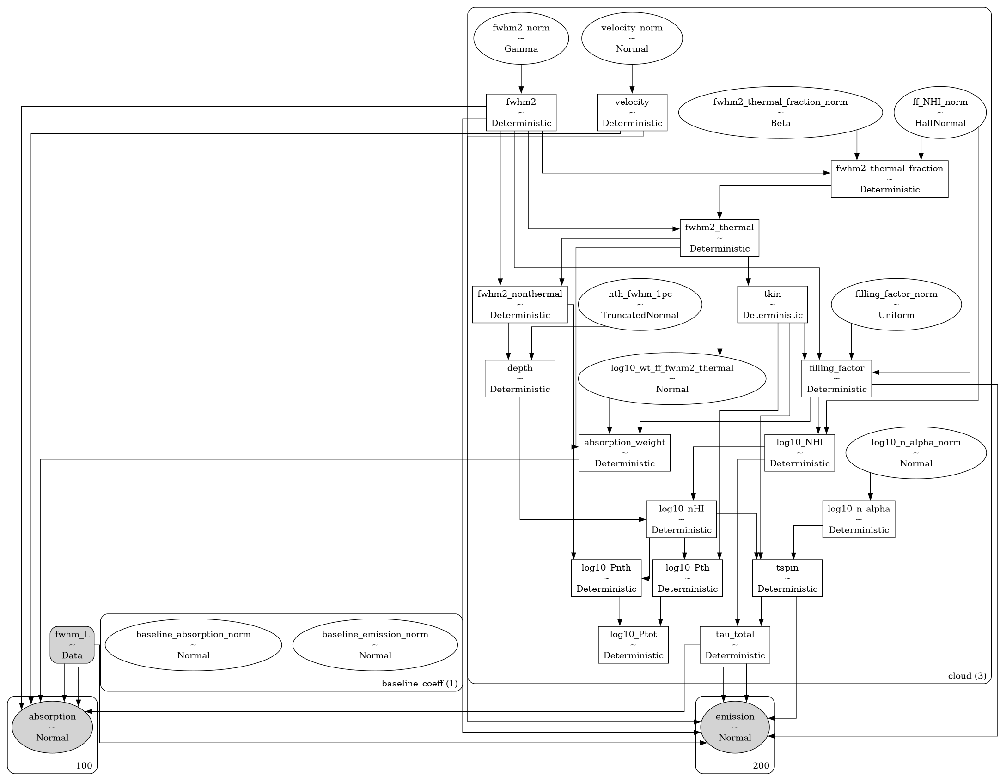

# `caribou_hi` <!-- omit in toc -->


[](https://caribou-hi.readthedocs.io/en/latest/?badge=latest)
[](https://codecov.io/gh/tvwenger/caribou_hi)

A Bayesian Model of the Diffuse Neutral Interstellar Medium

`caribou_hi` is a Bayesian model of the diffuse neutral interstellar medium written in the [`bayes_spec`](https://github.com/tvwenger/bayes_spec) spectral line modeling framework, which enables inference from observations of neutral hydrogen (HI) 21-cm emission and absorption spectra.

Read below to get started, and check out the tutorials and guides here: https://caribou-hi.readthedocs.io.

- [Installation](#installation)
  - [Basic Installation](#basic-installation)
  - [Development Installation](#development-installation)
- [Notes on Physics \& Radiative Transfer](#notes-on-physics--radiative-transfer)
- [Models](#models)
  - [`HIModel`](#himodel)
    - [`AbsorptionModel`](#absorptionmodel)
    - [`EmissionModel`](#emissionmodel)
    - [`EmissionAbsorptionModel`](#emissionabsorptionmodel)
  - [`HIPhysicalModel`](#hiphysicalmodel)
    - [`AbsorptionPhysicalModel`](#absorptionphysicalmodel)
    - [`EmissionPhysicalModel`](#emissionphysicalmodel)
    - [`EmissionAbsorptionPhysicalModel`](#emissionabsorptionphysicalmodel)
  - [`fwhm_L`](#fwhm_l)
- [Syntax \& Examples](#syntax--examples)
- [Issues and Contributing](#issues-and-contributing)
- [License and Copyright](#license-and-copyright)

# Installation

## Basic Installation

Install with `pip` in a `conda` virtual environment:
```
conda create --name caribou_hi -c conda-forge pymc cxx-compiler pip
conda activate caribou_hi
# Due to a bug in arviz, this fork is temporarily necessary
# See: https://github.com/arviz-devs/arviz/issues/2437
pip install git+https://github.com/tvwenger/arviz.git@plot_pair_reference_labels
pip install caribou_hi
```

## Development Installation

Alternatively, download and unpack the [latest release](https://github.com/tvwenger/caribou_hi/releases/latest), or [fork the repository](https://docs.github.com/en/pull-requests/collaborating-with-pull-requests/working-with-forks/fork-a-repo) and contribute to the development of `caribou_hi`!

Install in a `conda` virtual environment:
```
cd /path/to/caribou_hi
conda env create -f environment.yml
conda activate caribou_hi-dev
pip install -e .
```

# Notes on Physics & Radiative Transfer

All models in `caribou_hi` apply the same physics and equations of radiative transfer.

The 21-cm excitation temperature (also called the spin temperature) is derived from the gas kinetic temperature, gas density, and Ly&alpha; photon density following [Kim et al. (2014) equation 4](https://ui.adsabs.harvard.edu/abs/2014ApJ...786...64K/abstract).

Clouds are assumed to be homogenous and isothermal. The ratio of the column density to the volume density, both free parameters, thus determines the path length through the cloud. The non-thermal line broadening assumes a size-linewidth relationship. The clouds are assumed to have a log-normal column density distribution, such that the a cloud seen in absorption tends to have a *lower* column density than what is seen in emission.

The optical depth and radiative transfer prescriptions follow that of [Marchal et al. (2019)](https://ui.adsabs.harvard.edu/abs/2019A%26A...626A.101M/abstract). By default, the clouds are ordered from *nearest* to *farthest*, so optical depth effects (i.e., self-absorption) may be present.

Notably, since these are *forward models*, we do not make assumptions regarding the optical depth. These effects are *predicted* by the model.

# Models

The models provided by `caribou_hi` are implemented in the [`bayes_spec`](https://github.com/tvwenger/bayes_spec) framework. `bayes_spec` assumes that the source of spectral line emission can be decomposed into a series of "clouds", each of which is defined by a set of model parameters. Here we define the models available in `caribou_hi`.

## `HIModel`

`HIModel` is the base "observational" `caribou_hi` model. `EmissionModel`, `AbsorptionModel`, and `EmissionAbsorptionModel` extend `HIModel`. This model is parameterized in terms of observational quantities such that it mimics the interpretation of traditional *inverse modeling* techniques. Note that this is still a *forward* model, but the observational quantities (i.e., brightness temperature) are treated as the "fundamental" parameters. The following table describes `HIModel` shared parameters in more detail.

| Cloud Parameter<br>`variable` | Parameter                               | Units     | Prior, where<br>($p_0, p_1, \dots$) = `prior_{variable}`     | Default<br>`prior_{variable}` |
| :---------------------------- | :-------------------------------------- | :-------- | :----------------------------------------------------------- | :---------------------------- |
| `fwhm2`                       | Square FWHM line width                  | `km2 s-2` | $\Delta V^2 \sim p\times{\rm ChiSquared}(\nu=1)$             | `500.0`                       |
| `log10_nHI`                   | log10 HI volume density                 | `cm-3`    | $\log_{10}n_{\rm HI} \sim {\rm Normal}(\mu=p_0, \sigma=p_1)$ | `[0.0, 1.5]`                  |
| `velocity`                    | Velocity (same reference frame as data) | `km s-1`  | $V \sim {\rm Normal}(\mu=p_0, \sigma=p_1)$                   | `[0.0, 10.0]`                 |
| `log10_n_alpha`               | log10 Ly&alpha; photon density          | `cm-3`    | $\log_{10}n_\alpha \sim {\rm Normal}(\mu=p_0, \sigma=p_1)$   | `[-6.0, 2.0]`                 |
| `fwhm_L`                      | Lorentzian FWHM line width              | `km s-1`  | $\Delta V_{L} \sim {\rm HalfNormal}(\sigma=p)$               | `None`                        |

### `AbsorptionModel`

`AbsorptionModel` is a model that predicts 21-cm absorption (`1-exp(-tau)`) spectra. `AbsorptionModel` extends `HIModel`. The `SpecData` key for this model must be `absorption`. The following diagram demonstrates the relationship between the free parameters (empty ellipses), deterministic quantities (rectangles), model predictions (filled ellipses), and observations (filled, round rectangles). Many of the parameters are internally normalized (and thus have names like `_norm`). The subsequent table describes the additional `AbsorptionModel` parameters in more detail.


| Cloud Parameter<br>`variable` | Parameter                                      | Units    | Prior, where<br>($p_0, p_1, \dots$) = `prior_{variable}`    | Default<br>`prior_{variable}` |
| :---------------------------- | :--------------------------------------------- | :------- | :---------------------------------------------------------- | :---------------------------- |
| `tau_total`                   | Integrated optical depth                       | `km s-1` | $\int \tau_V dV \sim {\rm HalfNormal}(\sigma=p)$            | `10.0`                        |
| `tkin_factor`                 | Kinetic temperature / max. kinetic temperature | ``       | $T_K/T_{K, \rm max} \sim {\rm Beta}(\alpha=p_0, \beta=p_1)$ | `[2.0, 2.0]`                  |

The `tkin_factor` parameter sets the kinetic temperature in the range from zero to the maximum kinetic temperature allowed by the FWHM.

### `EmissionModel`

`EmissionModel` is similar to `AbsorptionModel`, except it predicts 21-cm emission brightness temperature spectra. `EmissionModel` extends `HIModel`. The `SpecData` key for this model must be `emission`. `EmissionModel` takes an additional initialization argument, `bg_temp`, which is the assumed background brightness temperature (by default it is `bg_temp=3.77`, an estimate for the cosmic microwave background and Galactic synchrotron emission at 21-cm). The following diagram demonstrates the model, and the subsequent table describes the additional `EmissionModel` parameters.


| Cloud Parameter<br>`variable` | Parameter                                      | Units      | Prior, where<br>($p_0, p_1, \dots$) = `prior_{variable}`    | Default<br>`prior_{variable}` |
| :---------------------------- | :--------------------------------------------- | :--------- | :---------------------------------------------------------- | :---------------------------- |
| `filling_factor`              | Filling factor                                 | ``         | $f \sim {\rm Uniform}(T_B/T_S, 1.0)$                        | ``                            |
| `TB_fwhm`                     | Brightness temperature x FWHM                  | `K km s-1` | $T_B \Delta V \sim {\rm HalfNormal}(\sigma=p)$              | `1000.0`                      |
| `tkin_factor`                 | Kinetic temperature / max. kinetic temperature | ``         | $T_K/T_{K, \rm max} \sim {\rm Beta}(\alpha=p_0, \beta=p_1)$ | `[2.0, 2.0]`                  |

The `filling_factor` parameter accounts for beam dilution in the emission spectrum. The expected brightness temperature contribution from a cloud is multiplied by `filling_factor`, which takes values between $f_{\rm min} = T_B/T_S$ and one.

The `tkin_factor` parameter sets the kinetic temperature in the range from $T_B$ to the maximum kinetic temperature allowed by the FWHM.

### `EmissionAbsorptionModel`

`EmissionAbsorptionModel` predicts both 21-cm emission (brightness temperature) and absorption (`1-exp(-tau)`) spectra. `EmissionAbsorptionModel` extends `EmissionModel`. The `SpecData` keys must be `emission` and `absorption`. The following diagram demonstrates the model, and the subsequent table describes the additional `EmissionAbsorptionModel` parameters.


| Cloud Parameter<br>`variable` | Parameter                                               | Units | Prior, where<br>($p_0, p_1, \dots$) = `prior_{variable}`                         | Default<br>`prior_{variable}`            |
| :---------------------------- | :------------------------------------------------------ | :---- | :------------------------------------------------------------------------------- | :--------------------------------------- |
| `log10_wt_ff_tkin`            | Absorption weight / (filling factor x spin temperature) | `K-1` | $\log_{10} f/(w_\tau T_s) \sim {\rm Normal}(\mu, \sigma_{\log_{10} N_{\rm HI}})$ | $\sigma_{\log_{10} N_{\rm HI}}$ = `None` |

The `absorption_weight` parameter accounts for the difference between the column density probed in absorption and that probed in emission. Specifically, $N_{\rm HI, abs}/N_{\rm HI, em} = f/w_\tau$. By default, `absorption_weight` is assumed to be one; the column density seen in absorption is identical to that seen in emission. This is the default behavior, and when `prior_sigma_log10_NHI = None`. Otherwise, the absorption column density is drawn from a log-normal distribution with a width given by `prior_sigma_log10_NHI`. Note that the mode of this distribution is less than the mean, so the assumption of a log-normal column density will tend to decrease the column density probed by absorption.

## `HIPhysicalModel`

`HIPhysicalModel` is the base "physical" `caribou_hi` model. `EmissionPhysicalModel`, `AbsorptionPhysicalModel`, and `EmissionAbsorptionPhysicalModel` extend `HIModel`. This model is parameterized in terms of physical quantities, which enables us to include additional physical constraints such as a size-linewidth relationship. The assumed value for the size-linewidth power law index is set at initialization time by the parameter `depth_nth_fwhm_power`. The following table describes `HIPhysicalModel` shared parameters in more detail.

| Cloud Parameter<br>`variable` | Parameter                                 | Units     | Prior, where<br>($p_0, p_1, \dots$) = `prior_{variable}`                              | Default<br>`prior_{variable}` |
| :---------------------------- | :---------------------------------------- | :-------- | :------------------------------------------------------------------------------------ | :---------------------------- |
| `fwhm2`                       | Square FWHM line width                    | `km2 s-2` | $\Delta V^2 \sim p\times{\rm ChiSquared}(\nu=1)$                                      | `500.0`                       |
| `velocity`                    | Velocity (same reference frame as data)   | `km s-1`  | $V \sim {\rm Normal}(\mu=p_0, \sigma=p_1)$                                            | `[0.0, 10.0]`                 |
| `log10_n_alpha`               | log10 Ly&alpha; photon density            | `cm-3`    | $\log_{10}n_\alpha \sim {\rm Normal}(\mu=p_0, \sigma=p_1)$                            | `[-6.0, 2.0]`                 |
| `nth_fwhm_1pc`                | Non-thermal FWHM line width at 1 pc depth | `km s-1`  | $\Delta V_{\rm nth} \sim {\rm TruncatedNormal}(\mu=p_0, \sigma=p_1, {\rm lower}=0.0)$ | `[1.75, 0.25]`                |
| `fwhm_L`                      | Lorentzian FWHM line width                | `km s-1`  | $\Delta V_{L} \sim {\rm HalfNormal}(\sigma=p)$                                        | `None`                        |

### `AbsorptionPhysicalModel`

`AbsorptionPhysicalModel` is a model that predicts 21-cm absorption (`1-exp(-tau)`) spectra. `AbsorptionPhysicalModel` extends `HIPhysicalModel`. The `SpecData` key for this model must be `absorption`. The following diagram demonstrates the relationship between the free parameters (empty ellipses), deterministic quantities (rectangles), model predictions (filled ellipses), and observations (filled, round rectangles). Many of the parameters are internally normalized (and thus have names like `_norm`). The subsequent table describes the additional `AbsorptionPhysicalModel` parameters in more detail.


| Cloud Parameter<br>`variable` | Parameter                       | Units          | Prior, where<br>($p_0, p_1, \dots$) = `prior_{variable}`                | Default<br>`prior_{variable}` |
| :---------------------------- | :------------------------------ | :------------- | :---------------------------------------------------------------------- | :---------------------------- |
| `NHI_fwhm2_thermal`           | Column density / thermal FWHM^2 | `cm-2 km-2 s2` | $N_{\rm HI}/\Delta V_{\rm th}^2 \sim {\rm HalfNormal}(\sigma=p)$        | `1.0e20`                      |
| `fwhm2_thermal_fraction`      | Thermal FWHM^2 / total FWHM^2   | ``             | $\Delta V_{\rm th}^2/\Delta V^2 \sim {\rm Beta}(\alpha=p_0, \beta=p_1)$ | `[2.0, 2.0]`                  |

### `EmissionPhysicalModel`

`EmissionPhysicalModel` is similar to `AbsorptionModel`, except it predicts 21-cm emission brightness temperature spectra. `EmissionPhysicalModel` extends `HIPhysicalModel`. The `SpecData` key for this model must be `emission`. `EmissionModel` takes an additional initialization argument, `bg_temp`, which is the assumed background brightness temperature (by default it is `bg_temp=3.77`, an estimate for the cosmic microwave background and Galactic synchrotron emission at 21-cm). The following diagram demonstrates the model, and the subsequent table describes the additional `EmissionPhysicalModel` parameters.


| Cloud Parameter<br>`variable` | Parameter                       | Units  | Prior, where<br>($p_0, p_1, \dots$) = `prior_{variable}`                | Default<br>`prior_{variable}` |
| :---------------------------- | :------------------------------ | :----- | :---------------------------------------------------------------------- | :---------------------------- |
| `filling_factor`              | Filling factor                  | ``     | $f \sim {\rm Uniform}(T_B/T_S, 1.0)$                                    | ``                            |
| `ff_NHI`                      | Filling factor x column density | `cm-2` | $f N_{\rm HI} \sim {\rm HalfNormal}(\sigma=p)$                          | `1.0e21`                      |
| `fwhm2_thermal_fraction`      | Thermal FWHM^2 / total FWHM^2   | ``     | $\Delta V_{\rm th}^2/\Delta V^2 \sim {\rm Beta}(\alpha=p_0, \beta=p_1)$ | `[2.0, 2.0]`                  |

The `fwhm2_thermal_fraction` parameter sets the thermal line width in the range from the minimum, set by the optically thin brightness temperature, to the total line width.

### `EmissionAbsorptionPhysicalModel`

`EmissionAbsorptionPhysicalModel` predicts both 21-cm emission (brightness temperature) and absorption (`1-exp(-tau)`) spectra. `EmissionAbsorptionPhysicalModel` extends `EmissionPhysicalModel`. The `SpecData` keys must be `emission` and `absorption`. The following diagram demonstrates the model, and the subsequent table describes the additional `EmissionAbsorptionPhysicalModel` parameters.



| Cloud Parameter<br>`variable` | Parameter                                               | Units | Prior, where<br>($p_0, p_1, \dots$) = `prior_{variable}`                         | Default<br>`prior_{variable}`           |
| :---------------------------- | :------------------------------------------------------ | :---- | :------------------------------------------------------------------------------- | :-------------------------------------- |
| `log10_wt_ff_tkin`            | Absorption weight / (filling factor x spin temperature) | `K-1` | $\log_{10} f/(w_\tau T_s) \sim {\rm Normal}(\mu, \sigma_{\log_{10} N_{\rm HI}})$ | $\sigma_{\log_{10} N_{\rm HI}}$ = `0.5` |

The `absorption_weight` parameter accounts for the difference between the column density probed in absorption and that probed in emission. Specifically, $N_{\rm HI, abs}/N_{\rm HI, em} = f/w_\tau$. The absorption column density is drawn from a log-normal distribution with a width given by `prior_sigma_log10_NHI`.

## `fwhm_L`

The `velocity` of a cloud can be challenging to identify when spectral lines are narrow and widely separated. We overcome this limitation by modeling the line profiles as a "pseudo-Voight" profile, which is a linear combination of a Gaussian and Lorentzian profile. The parameter `fwhm_L` is a latent hyper-parameter (shared among all clouds) that characterizes the width of the Lorentzian part of the line profile. When `fwhm_L` is zero, the line is perfectly Gaussian. This parameter produces line profile wings that may not be physical but nonetheless enable the optimization algorithms (i.e, MCMC) to converge more reliably and efficiently. Model solutions with non-zero `fwhm_L` should be scrutinized carefully. This feature can be turned off by supplying `None` (default) to `prior_fwhm_L`, in which case the line profiles are assumed Gaussian.

It can also be useful to give Variational Inference a head-start by initializing it evenly spread over the velocity prior. Supply `start = {"velocity_norm", np.linspace(-3.0, 3.0, model.n_clouds)}` to `model.fit()` or in `init_kwargs` to `model.sample()`. Check out [the `bayes_spec` tutorial](https://bayes-spec.readthedocs.io/en/stable/notebooks/basic_tutorial.html) for an example.

# Syntax & Examples

See the various tutorial notebooks under [docs/source/notebooks](https://github.com/tvwenger/caribou_hi/tree/main/docs/source/notebooks). Tutorials and the full API are available here: https://caribou-hi.readthedocs.io.

# Issues and Contributing

Anyone is welcome to submit issues or contribute to the development of this software via [Github](https://github.com/tvwenger/caribou_hi).

# License and Copyright

Copyright (c) 2024-2025 Trey Wenger

Trey V. Wenger; tvwenger@gmail.com

This code is licensed under MIT license (see LICENSE for details)
