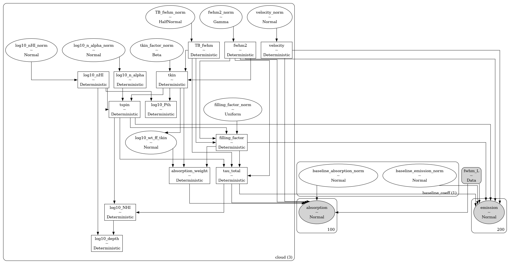

# `caribou_hi` <!-- omit in toc -->


[](https://caribou-hi.readthedocs.io/en/latest/?badge=latest)
[](https://codecov.io/gh/tvwenger/caribou_hi)

A Bayesian Model of the Diffuse Neutral Interstellar Medium

`caribou_hi` is a Bayesian model of the diffuse neutral interstellar medium written in the [`bayes_spec`](https://github.com/tvwenger/bayes_spec) spectral line modeling framework, which enables inference from observations of neutral hydrogen (HI) 21-cm emission and absorption spectra.

Read below to get started, and check out the tutorials and guides here: https://caribou-hi.readthedocs.io.

- [Installation](#installation)
  - [Basic Installation](#basic-installation)
  - [Development Installation](#development-installation)
- [Notes on Physics \& Radiative Transfer](#notes-on-physics--radiative-transfer)
- [Models](#models)
  - [`AbsorptionModel`](#absorptionmodel)
  - [`EmissionModel`](#emissionmodel)
  - [`EmissionAbsorptionModel`](#emissionabsorptionmodel)
  - [`ordered`](#ordered)
  - [`fwhm_L`](#fwhm_l)
- [Syntax \& Examples](#syntax--examples)
- [Issues and Contributing](#issues-and-contributing)
- [License and Copyright](#license-and-copyright)

# Installation

## Basic Installation

Install with `pip` in a `conda` virtual environment:
```
conda create --name caribou_hi -c conda-forge pymc cxx-compiler pip
conda activate caribou_hi
# Due to a bug in arviz, this fork is temporarily necessary
# See: https://github.com/arviz-devs/arviz/issues/2437
pip install git+https://github.com/tvwenger/arviz.git@plot_pair_reference_labels
pip install caribou_hi
```

## Development Installation

Alternatively, download and unpack the [latest release](https://github.com/tvwenger/caribou_hi/releases/latest), or [fork the repository](https://docs.github.com/en/pull-requests/collaborating-with-pull-requests/working-with-forks/fork-a-repo) and contribute to the development of `caribou_hi`!

Install in a `conda` virtual environment:
```
cd /path/to/caribou_hi
conda env create -f environment.yml
conda activate caribou_hi-dev
pip install -e .
```

# Notes on Physics & Radiative Transfer

All models in `caribou_hi` apply the same physics and equations of radiative transfer.

The 21-cm excitation temperature (also called the spin temperature) is derived from the gas kinetic temperature, gas density, and Ly&alpha; photon density following [Kim et al. (2014) equation 4](https://ui.adsabs.harvard.edu/abs/2014ApJ...786...64K/abstract).

Clouds are assumed to be homogenous and isothermal. The ratio of the column density to the volume density, both free parameters, thus determines the path length through the cloud. The non-thermal line broadening assumes a Larson law relationship.

The optical depth and radiative transfer prescriptions follow that of [Marchal et al. (2019)](https://ui.adsabs.harvard.edu/abs/2019A%26A...626A.101M/abstract). By default, the clouds are ordered from *nearest* to *farthest*, so optical depth effects (i.e., self-absorption) may be present.

Notably, since these are *forward models*, we do not make assumptions regarding the optical depth. These effects are *predicted* by the model. There is one exception: the `ordered` argument, [described below](#ordered).

# Models

The models provided by `caribou_hi` are implemented in the [`bayes_spec`](https://github.com/tvwenger/bayes_spec) framework. `bayes_spec` assumes that the source of spectral line emission can be decomposed into a series of "clouds", each of which is defined by a set of model parameters. Here we define the models available in `caribou_hi`.

## `AbsorptionModel`

Note that this model struggles to fit absorption-only data. We recommend sticking to `EmissionModel` and `EmissionAbsorptionModel`, so hopefully you have some emission data too!

`AbsorptionModel` is a model that predicts 21-cm absorption spectra. The `SpecData` key for this model must be `absorption`. The following diagram demonstrates the relationship between the free parameters (empty ellipses), deterministic quantities (rectangles), model predictions (filled ellipses), and observations (filled, round rectangles). Many of the parameters are internally normalized (and thus have names like `_norm`). The subsequent tables describe the model parameters in more detail.


| Cloud Parameter<br>`variable` | Parameter                                 | Units    | Prior, where<br>($p_0, p_1, \dots$) = `prior_{variable}`              | Default<br>`prior_{variable}` |
| :---------------------------- | :---------------------------------------- | :------- | :-------------------------------------------------------------------- | :---------------------------- |
| `log10_NHI`                   | log10 HI column density                   | `cm-2`   | $\log_{10}N_{\rm HI} \sim {\rm Normal}(\mu=p_0, \sigma=p_1)$          | `[20.0, 1.0]`                 |
| `log10_depth`                 | log10 line-of-sight depth                 | `pc`     | $\log_{10}d \sim {\rm Normal}(\mu=p_0, \sigma=p_1)$                   | `[1.0, 1.0]`                  |
| `log10_pressure`              | log10 pressure                            | `K cm-3` | $\log_{10}P_{\rm th} \sim {\rm Normal}(\mu=p_0, \sigma=p_1)$          | `[3.0, 1.0]`                  |
| `velocity`                    | Velocity (same reference frame as data)   | `km s-1` | $V \sim {\rm Normal}(\mu=p_0, \sigma=p_1)$                            | `[0.0, 10.0]`                 |
| `log10_nth_fwhm_1pc`          | Non-thermal FWHM at 1 pc                  | `km s-1` | $\log_{10}\Delta V_{\rm 1 pc} \sim {\rm Normal}(\mu=p_0, \sigma=p_1)$ | `[0.2, 0.1]`                  |
| `depth_nth_fwhm_power`        | Nonthermal size-linewidth power law index | unitless | $\alpha \sim {\rm Gamma}(\mu=p_0, \sigma=p_1)$                        | `[0.3, 0.1]`                  |

| Hyper Parameter<br>`variable` | Parameter                      | Units    | Prior, where<br>($p_0, p_1, \dots$) = `prior_{variable}`   | Default<br>`prior_{variable}` |
| :---------------------------- | :----------------------------- | :------- | :--------------------------------------------------------- | :---------------------------- |
| `log10_n_alpha`               | log10 Ly&alpha; photon density | `cm-3`   | $\log_{10}n_\alpha \sim {\rm Normal}(\mu=p_0, \sigma=p_1)$ | `[-6.0, 1.0]`                 |
| `fwhm_L`                      | Lorentzian FWHM line width     | `km s-1` | $\Delta V_{L} \sim {\rm HalfNormal}(\sigma=p)$             | `None`                        |

The parameters describing the non-thermal line broadening, `log10_nth_fwhm_1pc` and `depth_nth_fwhm_power`, are treated as cloud parameters by default and with `hyper_depth_linewidth = False`. With `hyper_depth_linewidth = True`, however, these parameters are treated as hyper parameters (and thus shared between all clouds). The later imposes a bias by assuming that all clouds share the same size-linewidth relationship.

## `EmissionModel`

`EmissionModel` is similar to `AbsorptionModel`, except it predicts 21-cm emission brightness temperature spectra. The `SpecData` key for this model must be `emission`. `EmissionModel` takes an additional initialization argument, `bg_temp`, which is the assumed background brightness temperature (by default it is `bg_temp=3.77`, an estimate for the cosmic microwave background and Galactic synchrotron emission at 21-cm). The following diagram demonstrates the model.


## `EmissionAbsorptionModel`

`EmissionAbsorptionModel` predicts both 21-cm emission (brightness temperature) and absorption (`1-exp(-tau)`) spectra. The `SpecData` keys must be `emission` and `absorption`.  `EmissionAbsorptionModel` takes an additional initialization argument, `bg_temp`, which is the assumed background brightness temperature (by default it is `bg_temp=3.77`, an estimate for the cosmic microwave background and Galactic synchrotron emission at 21-cm). The following diagram demonstrates the model, and the subsequent table describe the additional model parameters.

Note that the filling factor, $f$, is unconstrained, so the reported column densities are really $N_{\rm HI}/f$.



| Cloud Parameter<br>`variable` | Parameter         | Units | Prior, where<br>($p_0, p_1, \dots$) = `prior_{variable}` | Default<br>`prior_{variable}` |
| :---------------------------- | :---------------- | :---- | :------------------------------------------------------- | :---------------------------- |
| `filling_factor`              | Filling Factor    | ``    | $f \sim {\rm Uniform}(0, 1)$                             | ``                            |
| `absorption_weight`           | Absorption weight | ``    | $w_\tau \sim {\rm Beta}(\alpha=0, \beta=1-f)$            | ``                            |

The `filling_factor` parameter accounts for beam dilution in the emission spectrum. The expected brightness temperature contribution from a cloud is multiplied by `filling_factor`, which takes values between zero and one.

The `absorption_weight` parameter accounts for the probability that a cloud that appears in the emission beam is not traced by the absorption sightline. The absorption optical depth of a cloud is multiplied by `absorption_weight`, which takes values between zero and one. The prior is chosen to require `absorption_weight=1` when `filling_factor=1`.

## `ordered`

An additional parameter to `set_priors` for these models is `ordered`. By default, this parameter is `False`, in which case the order of the clouds is from *nearest* to *farthest*. Sampling from these models can be challenging due to the labeling degeneracy: if the order of clouds does not matter (i.e., the emission is optically thin), then each Markov chain could decide on a different, equally-valid order of clouds.

If we assume that the emission is optically thin, then we can set `ordered=True`, in which case the order of clouds is restricted to be increasing with velocity. This assumption can *drastically* improve sampling efficiency. When `ordered=True`, the `velocity` prior is defined differently:

| Cloud Parameter<br>`variable` | Parameter | Units    | Prior, where<br>($p_0, p_1, \dots$) = `prior_{variable}`                 | Default<br>`prior_{variable}` |
| :---------------------------- | :-------- | :------- | :----------------------------------------------------------------------- | :---------------------------- |
| `velocity`                    | Velocity  | `km s-1` | $V_i \sim p_0 + \sum_0^{i-1} V_i + {\rm Gamma}(\alpha=2, \beta=1.0/p_1)$ | `[0.0, 1.0]`                  |

## `fwhm_L`

The `velocity` of a cloud can be challenging to identify when spectral lines are narrow and widely separated. We overcome this limitation by modeling the line profiles as a "pseudo-Voight" profile, which is a linear combination of a Gaussian and Lorentzian profile. The parameter `fwhm_L` is a latent hyper-parameter (shared among all clouds) that characterizes the width of the Lorentzian part of the line profile. When `fwhm_L` is zero, the line is perfectly Gaussian. This parameter produces line profile wings that may not be physical but nonetheless enable the optimization algorithms (i.e, MCMC) to converge more reliably and efficiently. Model solutions with non-zero `fwhm_L` should be scrutinized carefully. This feature can be turned off by supplying `None` (default) to `prior_fwhm_L`, in which case the line profiles are assumed Gaussian.

It can also be useful to give Variational Inference a head-start by initializing it evenly spread over the velocity prior. Supply `start = {"velocity_norm", np.linspace(-3.0, 3.0, model.n_clouds)}` to `model.fit()` or in `init_kwargs` to `model.sample()`. Check out [the `bayes_spec` tutorial](https://bayes-spec.readthedocs.io/en/stable/notebooks/basic_tutorial.html) for an example.

# Syntax & Examples

See the various tutorial notebooks under [docs/source/notebooks](https://github.com/tvwenger/caribou_hi/tree/main/docs/source/notebooks). Tutorials and the full API are available here: https://caribou-hi.readthedocs.io.

# Issues and Contributing

Anyone is welcome to submit issues or contribute to the development of this software via [Github](https://github.com/tvwenger/caribou_hi).

# License and Copyright

Copyright (c) 2024 Trey Wenger

GNU General Public License v3 (GNU GPLv3)

This program is free software: you can redistribute it and/or modify
it under the terms of the GNU General Public License as published
by the Free Software Foundation, either version 3 of the License,
or (at your option) any later version.

This program is distributed in the hope that it will be useful,
but WITHOUT ANY WARRANTY; without even the implied warranty of
MERCHANTABILITY or FITNESS FOR A PARTICULAR PURPOSE.  See the
GNU General Public License for more details.

You should have received a copy of the GNU General Public License
along with this program.  If not, see <http://www.gnu.org/licenses/>.
